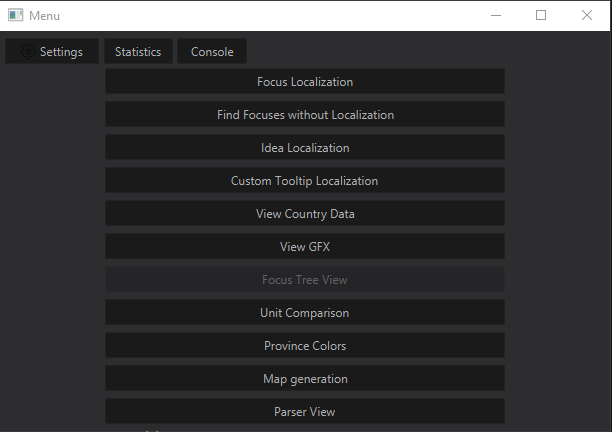

# HOIIVUtils

## Description

This Java application provides a user-friendly interface to interact with your Hearts of Iron 4 mod folder. It offers a variety of tools and utilities designed to enhance your modding experience, making it easier and more efficient.  

We created HOIIVUtils to help with our
["North America Divided"](https://steamcommunity.com/sharedfiles/filedetails/?id=2780506619)
Heats of Iron 4 mod.  
North America Divided: [https://discord.gg/AyJY59BcbM](https://discord.gg/AyJY59BcbM)  
HOIIVUtils: [https://discord.gg/dyakcKQZk9](https://discord.gg/dyakcKQZk9)

**WIP!** we are working on several things including:

- providing the jdk/jre along with the program.
- making an installer
- Changing where the settings save
- Several Util Windows that are already listed in the main window  
- A proper log and console
- Learn how to use containers and test on linux
- Not require a hoi4 mod source directories to see what the app can do.

## Usage
Please keep in mind how **WIP** this is!  
This is in pre-pre-alpha, and we consistently push commits that break the program.   
1. Install [Java 23.0.1](https://adoptium.net/temurin/releases/?version=23&os=any)  
2. Go to [releases](https://github.com/battleskorpion/HOIIVUtils/releases) and download HOIIVUtils.zip
3. Extract the zip
4. run  .bat or .sh
5. Select your hoi4 mod source directories (required!)  
6. Select your preferred settings  
7. Click Ok
