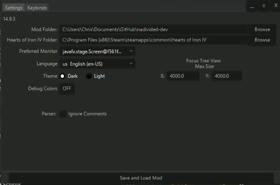

# HOIIVUtils

## Description

This Java application provides a user-friendly interface to interact with your Hearts of Iron 4 mod folder. It offers a variety of tools and utilities designed to enhance your modding experience, making it easier and more efficient.  

We created HOIIVUtils to help with our
["North America Divided"](https://steamcommunity.com/sharedfiles/filedetails/?id=2780506619)
Heats of Iron 4 mod.  
North America Divided: [https://discord.gg/AyJY59BcbM](https://discord.gg/AyJY59BcbM)  
HOIIVUtils: [https://discord.gg/dyakcKQZk9](https://discord.gg/dyakcKQZk9)

**WIP!** we are working on several things including:

- Demo Mod (50%)
- Keybindings? (0%)
- Open Logs (90%)
- Focus Localization (90%)
- Manage Focus Trees (50%)
- Idea Localization (75%)
- Custom Tooltip Localization (75%)
- View Country Data (90%)
- View GFX (15%)
- Focus Tree View (99%)
- Unit Comparison (75%)
- Province Colors (75%)
- Map Generation (90%)
- Parser View (0%)
- Everything :D

## Usage
Please keep in mind how **WIP** this is!  
This is in pre-pre-alpha, and we consistently push commits that break the program.   
1. Install [Java 23...](https://adoptium.net/temurin/releases/?version=23&os=any)  
2. Go to [releases...](https://github.com/battleskorpion/HOIIVUtils/releases) and download HOIIVUtils.zip
3. Extract the zip
4. run  .bat or .sh
5. Go to Settings
6. Select your preferred settings  
6. Click Ok

## Feedback

Please give us feedback at the [HOIIVUtils's Discord Server...](https://discord.gg/dyakcKQZk9)
